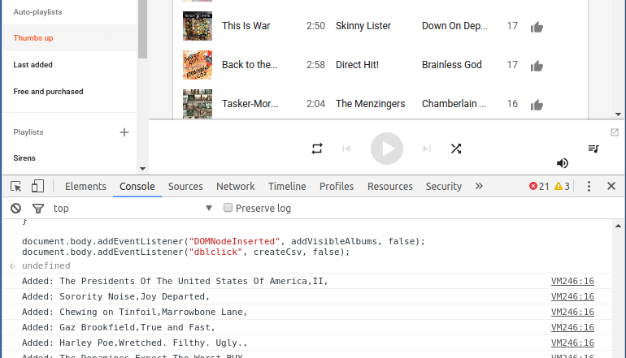
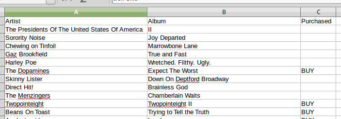

# Export Google Play playlist

This JavaScript allows you to export the albums in a Google Play playlist to a spreadsheet. It's helpful for exporting music you have thumbs-up'd while listening to the radio so you can download the albums at a later date.

##Instructions

1. Go here: https://play.google.com/music/listen#/ap/auto-playlist-thumbs-up

2. Open *Developer Tools* (F12) and paste [this JavaScript](export-google-play.js) into the *Console* tab

3. Scroll around so each album in the playlist is visible at least once

4. Double-click somewhere on the page to download `export-google-play.csv`

5. Open `export-google-play.csv` in Excel.

##Screenshots

###Console

###Output

